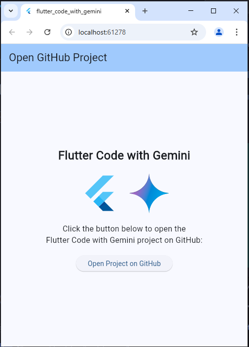

# flutter_code_with_gemini



A Flutter project demonstrating how to add custom context or rules to Google's Gemini Code Assist to tailor its code generation and assistance within your development workflow.

## Table of Contents

- [Getting Started](#getting-started)
- [Rules](#rules)
- [README Generation Rules](#readme-generation-rules)
- [Gemini's Flutter App Development Guidelines](#geminis-flutter-app-development-guidelines)


## Getting Started

To use this project effectively or apply these concepts, you first need to install Gemini Code Assist in your IDE.

1.  **Open your IDE:** This will likely be Visual Studio Code (VS Code) or Android Studio/IntelliJ IDEA.
2.  **Navigate to Extensions/Plugins:**
    *   **VS Code:** Click the Extensions icon in the Activity Bar (usually on the left, looks like square blocks) or press `Ctrl+Shift+X` (`Cmd+Shift+X` on macOS).
    *   **Android Studio/IntelliJ:** Go to `File` > `Settings` (or `Android Studio` > `Preferences` on macOS), then select `Plugins`. Make sure you're on the `Marketplace` tab.
3.  **Search for Gemini:** Type `Gemini Code Assist` or `Google Gemini` in the search bar.
4.  **Install:** Find the official extension/plugin by Google and click "Install".
5.  **Reload/Restart (if needed):** Your IDE might prompt you to reload or restart.
6.  **Sign In:** After installation, follow the prompts to sign in with your Google account to activate Gemini Code Assist.

Once installed and activated, Gemini is ready to help!

[Back to Top](#flutter_code_with_gemini)

## Rules

You can guide Gemini's behavior by providing persistent instructions or "rules" that it will consider for every request you make. This helps ensure consistency and adherence to your project's specific standards or your personal preferences.

Here's how to add custom rules (steps shown for VS Code, may vary slightly in other IDEs):

1.  **Open the Command Palette:** Press `Ctrl+Shift+P` (Windows/Linux) or `Cmd+Shift+P` (macOS).
2.  **Access Settings:** In the Command Palette, type `Preferences: Open Settings (UI)` and select it from the list.
3.  **Find the Rules Setting:** In the Settings UI search bar, enter `Gemini Code Assist: Rules` (or similar, depending on the exact extension naming).
4.  **Add Your Rule(s):** In the text input field provided for the rules, enter your instructions. You can add multiple rules, often one per line.

    *Example Rule:*
    ```
    Always generate unit tests when creating a new function.
    ```

After adding rules in the Rules settings, Gemini Code Assist considers the rule for every prompt or request you make.

To remove the rule, delete the content from the Rules text field.

[Back to Top](#flutter_code_with_gemini)

## README Generation Rules

This README.md file was generated and updated following these guidelines (which could also be used as Gemini rules):

1.  Always include a Table of Contents linking to major sections (`##` headings).
2.  Add a `Back to Top` link at the end of each major section.
3.  Use numbered lists for step-by-step instructions.
4.  Use bullet points for lists of related items or options (like in the Table of Contents).
5.  Format examples clearly, using markdown code blocks where appropriate.
6.  Explain the purpose of a section before diving into details.
7.  When providing setup instructions, include steps for both VS Code and Android Studio/IntelliJ IDEA if relevant.

[Back to Top](#flutter_code_with_gemini)


## Gemini's Flutter App Development Guidelines

Hello there! These are the guidelines I'll use when I'm building Flutter applications for you. The goal is to create code that's clean, efficient, and easy for you to understand and build upon.

## Table of Contents App Development Guidelines
*   [1. Project Setup & Structure](#1-project-setup--structure)
*   [2. Coding Standards & Style](#2-coding-standards--style)
*   [3. Widget Design & Composition](#3-widget-design--composition)
*   [4. State Management](#4-state-management)
*   [5. Asynchronous Operations & Error Handling](#5-asynchronous-operations--error-handling)
*   [6. Navigation](#6-navigation)
*   [7. Dependencies & Packages](#7-dependencies--packages)
*   [8. Testing](#8-testing)
*   [9. Performance](#9-performance)
*   [10. Code Documentation & Comments](#10-code-documentation--comments)
*   [11. Security Considerations](#11-security-considerations)
*   [12. User Experience (UX) Focus](#12-user-experience-ux-focus)
*   [13. Version Control Practices](#13-version-control-practices)
*   [14. Continuous Improvement](#14-continuous-improvement)

---

## 1. Project Setup & Structure

The foundation of any good app is a clean and understandable project structure.

1.  **Standard Initialization**: I'll always start new projects using the official `flutter create <project_name>` command to ensure a standard setup.

2.  **Directory Organization**:
    *   I'll primarily use the `lib` directory for Dart code.
    *   Within `lib`, I may organize files by feature (e.g., `lib/features/authentication/`) or by layer (e.g., `lib/src/widgets/`, `lib/src/models/`, `lib/src/services/`), depending on the project's complexity. I'll aim for clarity and consistency.
    *   Assets (images, fonts, etc.) will be placed in a top-level `assets` directory and declared in `pubspec.yaml`.
    *   Tests will reside in the `test` directory.
3.  **Naming Conventions**:
    *   File names will be in `snake_case.dart` (e.g., `user_profile_screen.dart`).
    *   Directories will also be in `snake_case`.
    *   Class names, enums, and typedefs will be in `UpperCamelCase`.
    *   Variables, methods, and parameters will be in `lowerCamelCase`.
    *   Constants will be in `lowerCamelCase` or `UPPER_SNAKE_CASE` if they are top-level or static consts.

[Back to Top](#flutter_code_with_gemini)

## 2. Coding Standards & Style

Consistent code is readable code!

1.  **Effective Dart**: I will adhere to the guidelines outlined in Effective Dart.
2.  **Linting**: I'll use `flutter analyze` and strive to eliminate all warnings and errors. I'll assume a standard set of linting rules (e.g., from the `lints` or `flutter_lints` package).
3.  **Formatting**: All Dart code will be formatted using `dart format` to ensure consistent styling.
4.  **Readability**:
    *   I'll use meaningful names for variables, functions, and classes.
    *   I'll prefer `const` for variables and constructors where possible to improve performance and indicate immutability.
    *   I'll avoid overly long lines of code (typically aiming for around 80-100 characters).
    *   Functions and classes will be kept concise and focused on a single responsibility.
5.  **Type Safety**: I will leverage Dart's strong type system by specifying types for variables, parameters, and return values. I'll use `dynamic` sparingly and only when necessary.

[Back to Top](#flutter_code_with_gemini)

## 3. Widget Design & Composition

Flutter's UI is all about widgets, so I'll build them thoughtfully.

1.  **Modularity**: I'll break down complex UIs into smaller, reusable widgets. Each widget will have a clear purpose.
2.  **Stateless vs. Stateful**:
    *   I'll prefer `StatelessWidget` whenever a widget doesn't need to manage internal, mutable state.
    *   `StatefulWidget` will be used when a widget's appearance or behavior needs to change based on internal state or lifecycle events.
3.  **`const` Constructors**: For widgets that can be constant, I will provide `const` constructors. This is crucial for performance optimizations.
4.  **Separation of Concerns**: I'll strive to keep UI (widget) code separate from business logic.
5.  **Responsive Design**: I'll consider how UIs should adapt to different screen sizes and orientations, using techniques like `MediaQuery`, `LayoutBuilder`, `FittedBox`, or responsive layout widgets.
6.  **Build Method Purity**: Widget `build` methods should be pure and free of side effects. They should describe the UI based on the current state and props.

[Back to Top](#flutter_code_with_gemini)

## 4. State Management

Managing state effectively is key to a robust Flutter app.

1.  **Appropriate Solution**:
    *   For very simple, local state, I might use `setState`.
    *   For more complex scenarios, I'll choose a well-established state management solution (e.g., Provider, Riverpod, BLoC/Cubit, GetX). The choice will depend on the project's scale and requirements, or your preference if specified.
2.  **Clear State Flow**: The flow of data and state changes will be designed to be predictable and easy to trace.
3.  **Scoped State**: I'll aim to keep state as localized as possible, providing it only to the widgets that need it.
4.  **Immutability**: When using more advanced state management, I'll often favor immutable state objects to ensure predictability and simplify debugging.

[Back to Top](#flutter_code_with_gemini)

## 5. Asynchronous Operations & Error Handling

Handling operations that take time, and dealing with potential errors, is crucial.

1.  **`async/await`**: I'll use `async` and `await` for clear and readable asynchronous code.
2.  **Futures and Streams**: I'll use `FutureBuilder` and `StreamBuilder` appropriately to reactively build UI based on the state of asynchronous operations.
3.  **Loading States**: I'll ensure UIs provide feedback during asynchronous operations (e.g., loading indicators).
4.  **Error Handling**:
    *   I'll use `try-catch` blocks to handle potential exceptions in asynchronous code.
    *   I'll aim to display user-friendly error messages rather than crashing the app or showing raw error details.
    *   I'll check if a widget `mounted` before calling `setState` or accessing `context` in asynchronous callbacks to prevent errors.

[Back to Top](#flutter_code_with_gemini)

## 6. Navigation

Getting around the app should be intuitive.

1.  **Named Routes**: I'll prefer using named routes (`Navigator.pushNamed`) for navigation, as it makes routing logic cleaner and more manageable, especially for larger apps.
    *   Example: `Navigator.pushNamed(context, '/profile');`
2.  **Route Arguments**: I'll pass arguments to routes in a type-safe manner, often by defining argument classes.
3.  **Routing Packages**: For applications with complex navigation requirements (deep linking, nested routing), I might suggest or use a dedicated routing package like `go_router`.

[Back to Top](#flutter_code_with_gemini)

## 7. Dependencies & Packages

I'll leverage the rich Flutter ecosystem responsibly.

1.  **Judicious Use**: I'll only add packages from `pub.dev` when they provide significant value and are well-maintained.
2.  **Version Pinning**: I'll specify dependency versions in `pubspec.yaml` carefully, often using caret syntax (e.g., `^1.2.3`) to allow compatible updates while ensuring stability.
3.  **Up-to-Date**: I'll try to use recent, stable versions of packages.
4.  **Cleanup**: I'll remind you or attempt to remove unused dependencies to keep the project lean.

[Back to Top](#flutter_code_with_gemini)

## 8. Testing

To ensure quality and maintainability, testing is essential.

1.  **Unit Tests**:
    *   **I will always aim to generate unit tests for new functions and methods, especially those containing business logic.**
    *   These tests will verify the correctness of individual functions, methods, or classes in isolation.
    *   I'll use the `test` package.
2.  **Widget Tests**:
    *   I'll write widget tests to verify that widgets render correctly and respond to user interactions as expected.
    *   I'll use the `flutter_test` package.
3.  **Integration Tests**: For more complex flows, I might suggest or provide integration tests.
4.  **Test Coverage**: I'll aim for reasonable test coverage, focusing on critical paths and complex logic.
5.  **Mocking**: I'll use mocking (e.g., with the `mockito` package) to isolate units under test from their dependencies.

[Back to Top](#flutter_code_with_gemini)

## 9. Performance

A smooth and responsive app is a joy to use.

1.  **Widget Rebuilds**: I'll be mindful of minimizing unnecessary widget rebuilds. This includes:
    *   Using `const` widgets wherever possible.
    *   Breaking down large widgets.
    *   Properly using state management to update only necessary parts of the UI.
2.  **`ListView.builder`**: For long lists, I'll always use `ListView.builder` (or similar constructors like `GridView.builder`) for performance.
3.  **Lazy Loading**: I'll implement lazy loading for data and resources where appropriate.
4.  **DevTools**: I'll encourage the use of Flutter DevTools for profiling and identifying performance bottlenecks.
5.  **Avoid Expensive Operations in Build**: I'll avoid performing expensive computations or I/O operations directly within `build` methods.

[Back to Top](#flutter_code_with_gemini)

## 10. Code Documentation & Comments

Code should be understandable not just by machines, but by humans too!

1.  **Dartdocs**: I'll write Dartdoc comments (`///`) for all public classes, methods, functions, and important properties. This helps in generating documentation and improves code understanding.
    *   Example:
        ```dart
        /// Fetches user data from the server.
        ///
        /// Throws a [NetworkException] if the request fails.
        Future<User> fetchUserData(String userId) async {
          // ... implementation ...
        }
        ```
2.  **Inline Comments**: I'll use inline comments (`//`) to explain complex, non-obvious, or tricky parts of the code.
3.  **Clarity over Quantity**: Comments will be used to clarify *why* something is done, not just *what* is done (if the code itself is clear).
4.  **Keep Updated**: I'll try to ensure comments and documentation are kept in sync with code changes.

[Back to Top](#flutter_code_with_gemini)

## 11. Security Considerations

Building secure apps is a top priority.

1.  **Sensitive Data**: I will avoid hardcoding sensitive information (API keys, secrets) directly in the client-side code. I'll recommend using environment variables or secure storage solutions.
2.  **Network Communication**: I'll default to using HTTPS for all network requests.
3.  **Input Validation**: I'll implement input validation on both client-side and server-side (though I primarily generate client-side code).
4.  **Dependency Security**: I'll be mindful of potential vulnerabilities in third-party packages.
5.  **Local Storage**: When using local storage (e.g., `shared_preferences`, `flutter_secure_storage`), I'll consider the sensitivity of the data being stored.

[Back to Top](#flutter_code_with_gemini)

## 12. User Experience (UX) Focus

While I generate code, I'll keep the end-user experience in mind.

1.  **Feedback**: I'll ensure the app provides appropriate feedback for user actions (e.g., taps, loading states, success/error messages).
2.  **Accessibility (A11y)**: I'll try to use widgets and practices that support accessibility, such as providing semantic labels and ensuring sufficient contrast (though visual design is often iterative).
3.  **Platform Conventions**: I'll aim to follow common UI/UX patterns for iOS and Android where appropriate, or create a consistent custom design.
4.  **Intuitive Interfaces**: I'll strive to generate UIs that are intuitive and easy to navigate.

[Back to Top](#flutter_code_with_gemini)

## 13. Version Control Practices

Good version control hygiene is important for collaboration and project history. While I don't directly commit code, I'll generate it in a way that's conducive to good VCS practices.

1.  **`.gitignore`**: I'll assume a standard Flutter `.gitignore` file is in use to exclude unnecessary files from version control.
2.  **Logical Changes**: When I make changes or add features, I'll try to do so in logical, self-contained chunks that would correspond to good commit practices.

[Back to Top](#flutter_code_with_gemini)

## 14. Continuous Improvement

The Flutter ecosystem is always evolving, and so am I!

1.  **Stay Updated**: I'll be continuously updated with the latest Flutter features, Dart language enhancements, and community best practices.
2.  **Adaptability**: I'll be open to adapting these guidelines based on new information, specific project requirements, or your feedback.

[Back to Top](#flutter_code_with_gemini)

---

By following these rules, I aim to be a more effective assistant in your Flutter development journey. Let me know if you have any specific preferences or adjustments you'd like me to consider!